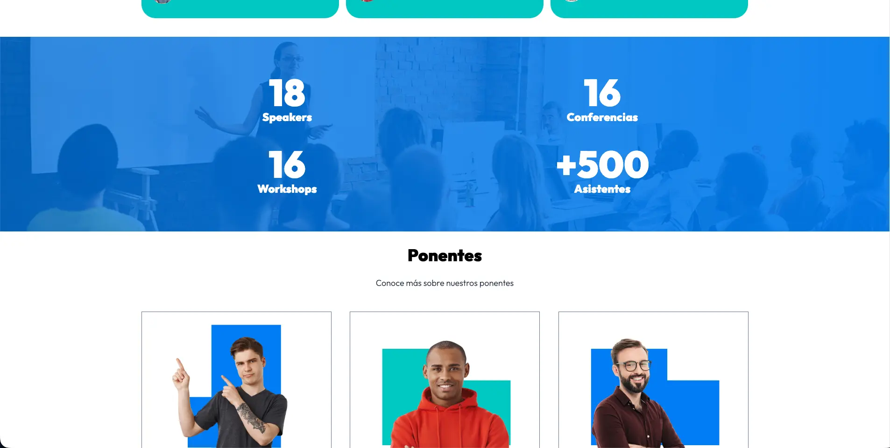
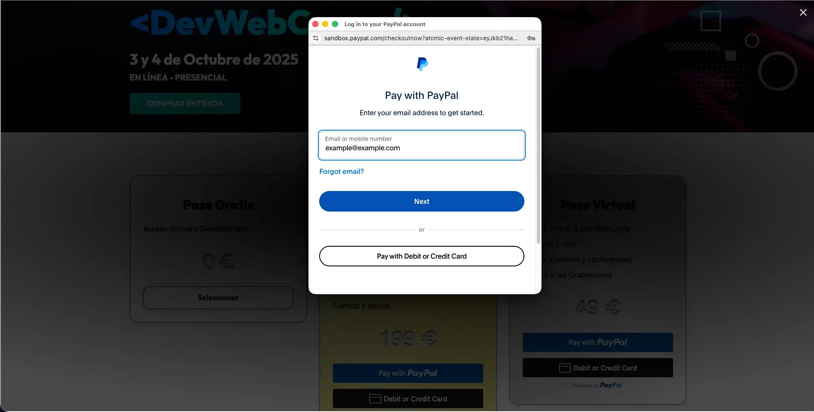
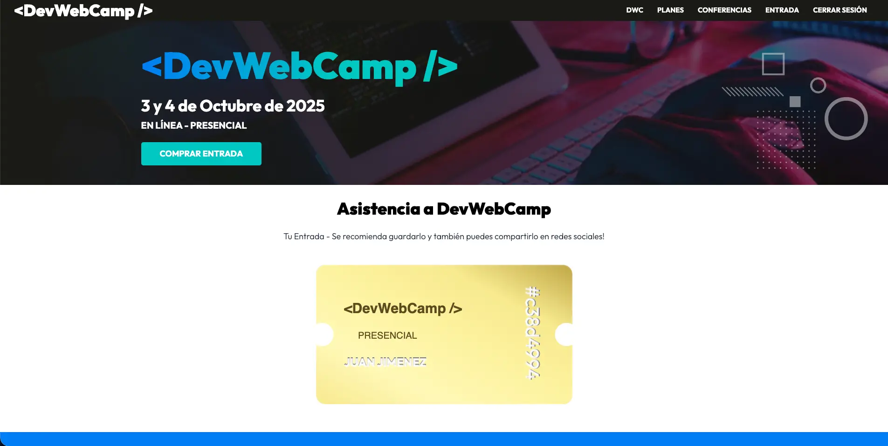

<table width="100%" align="center">
  <tr>
    <td align="center" valign="middle">
      <h1>🎟️ DevWebCamp - Conference Management</h1>
      
<b>Arquitectura MVC Personalizada para Gestión de Eventos de Alto Rendimiento</b>

      

      
PHP 8 | MySQL | JavaScript ES6 | SASS | Gulp

    </td>
  </tr>
</table>

<table>
  <tr>
    <td width="50%">
      

        
      

    </td>
    <td width="50%">
      

        
      

    </td>
  </tr>
  <tr>
    <td width="50%">
      

        
      

    </td>
    <td width="50%">
      

        
      

    </td>
  </tr>
</table>

## Visión General

**DevWebCamp** no es solo una web de conferencias; es una plataforma robusta diseñada para manejar el ciclo de vida completo de un evento tecnológico. Implementa una lógica de negocio compleja que incluye **control de aforo en tiempo real**, pasarela de pagos internacional y un sistema de autenticación de doble factor vía email.

El núcleo del proyecto es un **Framework MVC propio**, construido para maximizar el control sobre el flujo de datos y evitar el "overhead" de frameworks comerciales en procesos críticos.

---

## Stack Tecnológico y Justificación Técnica

En este proyecto, cada tecnología fue seleccionada para resolver un desafío arquitectónico específico:

| Tecnología | Implementación y Justificación en DevWebCamp |
| :--- | :--- |
| **PHP (Custom MVC)** | Utilizado para estructurar el proyecto bajo el patrón **Model-View-Controller**. Implementé un `Router.php` personalizado para gestionar URLs amigables y proteger rutas administrativas mediante Middlewares, asegurando que la lógica de negocio esté totalmente separada de la visualización. |
| **Active Record (ORM)** | Diseñé una clase base `ActiveRecord.php` que utiliza **Introspección de Base de Datos**. Esto permite que los modelos (`Ponente`, `Evento`, `Usuario`) hereden métodos CRUD automáticos, reduciendo drásticamente el código repetitivo y garantizando la integridad de los datos mediante sanitización integrada. |
| **API Restful (Backend)** | Desarrollé controladores específicos (`APIController.php`) que devuelven datos en formato **JSON**. Esto fue fundamental para alimentar el buscador de ponentes y la agenda de eventos sin necesidad de recargar la página, mejorando la fluidez de la UX. |
| **JavaScript (Async/Await)** | Implementado para consumir las APIs internas. Lo utilicé específicamente en el **módulo de selección de eventos** para validar el aforo disponible al instante y en la integración del **SDK de PayPal** para manejar transacciones asíncronas seguras. |
| **SASS (Arquitectura 7-1)** | Utilizado para mantener un código CSS escalable. Implementé mixins y variables para gestionar el diseño responsivo de la agenda (Grid/Flexbox), asegurando que las tablas de horarios sean legibles en dispositivos móviles. |
| **Gulp & Workflow** | Configurado para automatizar la tubería de desarrollo: compilación de SASS, minificación de JS y optimización de imágenes en formato WebP para reducir el tiempo de carga (LCP) y mejorar el SEO del evento. |

---

## Desafíos Técnicos Resueltos

### 1. Sistema de Aforo Dinámico
El mayor reto fue evitar el sobrecupo en talleres. Lo solucioné mediante una lógica en el servidor que cruza la tabla de `registros` con `eventos`. Si el contador llega al límite definido en la base de datos, el sistema de JavaScript bloquea automáticamente la selección en el frontend y el backend rechaza cualquier intento de inserción maliciosa.

### 2. Integración de Mapas y Geolocalización
Para facilitar la llegada al evento presencial, integré la API de **Leaflet / OpenStreetMap**. A diferencia de Google Maps, esta opción permite una personalización total del estilo del mapa sin costos asociados, manteniendo el rendimiento de la página principal.

### 3. Seguridad y Persistencia
Implementé un sistema de **Tokens temporales** para la confirmación de cuentas. Los usuarios no pueden comprar pases ni reservar talleres hasta que su cuenta sea verificada, evitando registros basura y ataques de fuerza bruta en la base de datos de MySQL.

---

## Estructura del Proyecto

* **`/classes`**: Lógica de soporte (Email, Paginación).
* **`/controllers`**: Manejo de la lógica de peticiones y respuestas.
* **`/models`**: Abstracción de la base de datos mediante Active Record.
* **`/src`**: Código fuente de assets (JS, SCSS) antes de ser procesados por Gulp.
* **`/views`**: Templates segmentados para una UI modular.